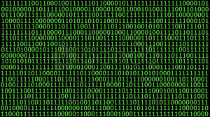

# Solucion de la Actividad

## 1. **Representacion de datos en una computadora**

Los datos se pueden representar en diferentes codigos, en las computadoras se representan mediante *codigos binarios*, lo que se conoce como secuencias de 0s y 1s, esos valores corresponden a los estadosdaos de encendidos y apagados de circuitos electronicos.

### Representacion de numeros
los numeros se representan o se codifican en binario, usando sistemas como el complemento a dos para la represnetacion de valores negativos

### Representacion de letras
Para representar letras y carracteres estos se convierten en codigos como **ASCII** (sistema de codificacion que asigna un valor nuemrico unico a diferentes caracteres) o **Unicode** el cual es utiizado para formatos de texto y tambien asigan un unico numero a cada caracter.

### Representacion de imagenes
las imagenes se almacen en matrices de pixeles, donde el pixel tienen los valores RGB codificados en codigo binario y se tiene en cuenta que cualquier dato de un omputadora seimpre se almacena y se encuentra en bits.

### 2. Conclusion sobre la figura 2

El número de estados diferentes que pueden ser representados por N variables binarias se calcula con la fórmula 2^N, por lo tanto con cada bit adcional se duplica el numero de combinaciones posibles, esto es fundamnetal en el diseño de las computadoras, porque permite manejar o ir desde caracteres hasta imagenes y videos.

### 3. Unidades de almacenamiento de datos

| Unidad     |Abreviación | Equivalencia         |
|------------|------------|----------------------|
| Byte       | B          | 8 bits               |
| Kilobyte   | KB         | 1,024 Bytes          |
| Megabyte   | MB         | 1,024 KB             |
| Gigabyte   | GB         | 1,024 MB             |
| Terabyte   | TB         | 1,024 GB             |
| Petabyte   | PB         | 1,024 TB             |
| Exabyte    | EB         | 1,024 PB             |

### 4. Importacia del trabjo de george boole
El matemático George Boole desarrolló el álgebra booleana, la base de la lógica binaria utilizada en computación. Su trabajo permitió la creación de circuitos lógicos en computadoras modernas, facilitando operaciones esenciales como sumas, restas y comparaciones mediante puertas lógicas (AND, OR, NOT).

# Ejercicio 2 - Resuelve
Conversión de binario a decimal:

- 1010101010₂ = (1×2⁹) + (0×2⁸) + (1×2⁷) + (0×2⁶) + (1×2⁵) + (0×2⁴) + (1×2³) + (0×2²) + (1×2¹) + (0×2⁰) **Resultado: 682**

- 11111₂ = (1×2⁴) + (1×2³) + (1×2²) + (1×2¹) + (1×2⁰) **Resultado: 31**

- 10000000₂ = (1×2⁷) + (0×2⁶) + (0×2⁵) + (0×2⁴) + (0×2³) + (0×2²) + (0×2¹) + (0×2⁰) **Resultado: 128**

- 100100100₂ = (1×2⁸) + (0×2⁷) + (0×2⁶) + (1×2⁵) + (0×2⁴) + (0×2³) + (1×2²) + (0×2¹) + (0×2⁰) **Resultado: 292**

## **Conversión de números decimales a binarios**

1. **$127_{10}$ a binario:**

   El número decimal **127** en binario es **$1111111_2$**.

   Procedimiento:
   - Dividimos 127 por 2, guardando los residuos:
     - 127 ÷ 2 = 63, residuo = 1
     - 63 ÷ 2 = 31, residuo = 1
     - 31 ÷ 2 = 15, residuo = 1
     - 15 ÷ 2 = 7, residuo = 1
     - 7 ÷ 2 = 3, residuo = 1
     - 3 ÷ 2 = 1, residuo = 1
     - 1 ÷ 2 = 0, residuo = 1
   - Leemos los residuos de abajo hacia arriba: **1111111**.

2. **$246_{10}$ a binario:**

   El número decimal **246** en binario es **$11110110_2$**.

   Procedimiento:
   - Dividimos 246 por 2, guardando los residuos:
     - 246 ÷ 2 = 123, residuo = 0
     - 123 ÷ 2 = 61, residuo = 1
     - 61 ÷ 2 = 30, residuo = 1
     - 30 ÷ 2 = 15, residuo = 0
     - 15 ÷ 2 = 7, residuo = 1
     - 7 ÷ 2 = 3, residuo = 1
     - 3 ÷ 2 = 1, residuo = 1
     - 1 ÷ 2 = 0, residuo = 1
   - Leemos los residuos de abajo hacia arriba: **11110110**.

3. **$1025_{10}$ a binario:**

   El número decimal **1025** en binario es **$10000000001_2$**.

   Procedimiento:
   - Dividimos 1025 por 2, guardando los residuos:
     - 1025 ÷ 2 = 512, residuo = 1
     - 512 ÷ 2 = 256, residuo = 0
     - 256 ÷ 2 = 128, residuo = 0
     - 128 ÷ 2 = 64, residuo = 0
     - 64 ÷ 2 = 32, residuo = 0
     - 32 ÷ 2 = 16, residuo = 0
     - 16 ÷ 2 = 8, residuo = 0
     - 8 ÷ 2 = 4, residuo = 0
     - 4 ÷ 2 = 2, residuo = 0
     - 2 ÷ 2 = 1, residuo = 0
     - 1 ÷ 2 = 0, residuo = 1
   - Leemos los residuos de abajo hacia arriba: **10000000001**.

4. **$354_{10}$ a binario:**

   El número decimal **354** en binario es **$101100010_2$**.

   Procedimiento:
   - Dividimos 354 por 2, guardando los residuos:
     - 354 ÷ 2 = 177, residuo = 0
     - 177 ÷ 2 = 88, residuo = 1
     - 88 ÷ 2 = 44, residuo = 0
     - 44 ÷ 2 = 22, residuo = 0
     - 22 ÷ 2 = 11, residuo = 0
     - 11 ÷ 2 = 5, residuo = 1
     - 5 ÷ 2 = 2, residuo = 1
     - 2 ÷ 2 = 1, residuo = 0
     - 1 ÷ 2 = 0, residuo = 1
   - Leemos los residuos de abajo hacia arriba: **101100010**.

# Actividad de Investigacion

## Tipos de Datos en Diferentes Lenguajes de Programación

### **1.TABLA DE COMPARACION ENTRE LENGUAJES**
| **Lenguaje** | **Nombre de la variable** | **Abreviación** | **Características principales** |
|--------------|---------------------------|-----------------|---------------------------------|
| **C**        | Entero (Integer)           | `int`           | Rango de -32,768 a 32,767 (16 bits) o -2,147,483,648 a 2,147,483,647 (32 bits). |
| **C**        | Flotante (Floating point)  | `float`         | Precisión simple, rango de ±3.4e-38 a ±3.4e+38. |
| **C**        | Doble precisión (Double)   | `double`        | Precisión doble, rango de ±1.7e-308 a ±1.7e+308. |
| **C**        | Carácter (Character)       | `char`          | 1 byte, representa un solo carácter. |
| **C**        | Booleano (Boolean)         | `bool`          | `true` (1) o `false` (0). |
| **C**        | Cadena de texto (String)   | `char[]`        | Array de caracteres terminados en nulo. |
| **Java**     | Entero (Integer)           | `int`           | Rango de -2,147,483,648 a 2,147,483,647. |
| **Java**     | Flotante (Floating point)  | `float`         | Precisión simple, rango de ±3.4e−38 a ±3.4e+38. |
| **Java**     | Doble precisión (Double)   | `double`        | Precisión doble, rango de ±1.7e−308 a ±1.7e+308. |
| **Java**     | Carácter (Character)       | `char`          | 16 bits, representa un carácter Unicode. |
| **Java**     | Booleano (Boolean)         | `boolean`       | `true` o `false`. |
| **Java**     | Cadena de texto (String)   | `String`        | Objeto que representa una secuencia de caracteres. |
| **Python**   | Entero (Integer)           | `int`           | Sin límite de tamaño, depende de la memoria disponible. |
| **Python**   | Flotante (Floating point)  | `float`         | Precisión doble, IEEE 754. |
| **Python**   | Doble precisión (Double)   | -               | No existe, ya que `float` es de doble precisión. |
| **Python**   | Carácter (Character)       | `str`           | Un solo carácter es una cadena. |
| **Python**   | Booleano (Boolean)         | `bool`          | `True` o `False`. |
| **Python**   | Cadena de texto (String)   | `str`           | Secuencia de caracteres Unicode. |

## Ejercicio de cálculo de espacio en memoria

Imaginemos que debemos almacenar la siguiente información cada 10 segundos durante 24 horas:

1. **Identificador numérico (Entero):**
   - Usaremos un entero de 4 bytes (en C, Java y Python `int` suele ocupar 4 bytes).

2. **Temperatura (Flotante):**
   - Usaremos un flotante de 4 bytes (en C y Java, `float` ocupa 4 bytes).

3. **Valor lógico (Booleano):**
   - Usaremos un valor booleano que ocupa 1 byte (típicamente 1 byte, aunque en algunos lenguajes puede ser más grande por razones de alineación).

4. **Texto con 10 caracteres:**
   - Usaremos una cadena de texto de 10 caracteres (en C, una cadena de texto con 10 caracteres ocupa 10 bytes. En Java y Python, cada carácter ocupa 2 bytes si es Unicode).

Ahora, calculamos cuánto espacio necesitamos para almacenar estos datos cada 10 segundos durante 24 horas.

1. **Datos por segundo:**
   - Un entero: 4 bytes
   - Un flotante: 4 bytes
   - Un booleano: 1 byte
   - Una cadena de 10 caracteres: 10 bytes
   - Total por segundo: \( 4 + 4 + 1 + 10 = 19 \, \text{bytes} \)

2. **Datos por minuto:**
   - Un minuto tiene 60 segundos, así que multiplicamos por 60:
   \[
   19 \, \text{bytes} \times 60 = 1140 \, \text{bytes por minuto}
   \]

3. **Datos por hora:**
   - Una hora tiene 60 minutos, así que multiplicamos por 60:
   \[
   1140 \, \text{bytes por minuto} \times 60 = 68,400 \, \text{bytes por hora}
   \]

4. **Datos por 24 horas:**
   - Multiplicamos por 24:
   \[
   68,400 \, \text{bytes por hora} \times 24 = 1,641,600 \, \text{bytes por 24 horas}
   \]
   - Esto equivale a **1.64 MB** (1,641,600 bytes ÷ 1,048,576 bytes/MB).

### **Conclusión**

A través de esta actividad, aprendí que la representación de los datos en las computadoras varía dependiendo del tipo de datos y del lenguaje de programación utilizado. Cada tipo de dato tiene un tamaño específico y un rango de valores posibles, lo que es esencial para administrar eficientemente los recursos de la computadora, como la memoria. En cuanto al cálculo del espacio en memoria, es fundamental entender cómo se gestionan los datos en diferentes tipos de variables y cómo esto impacta en el almacenamiento a largo plazo.

