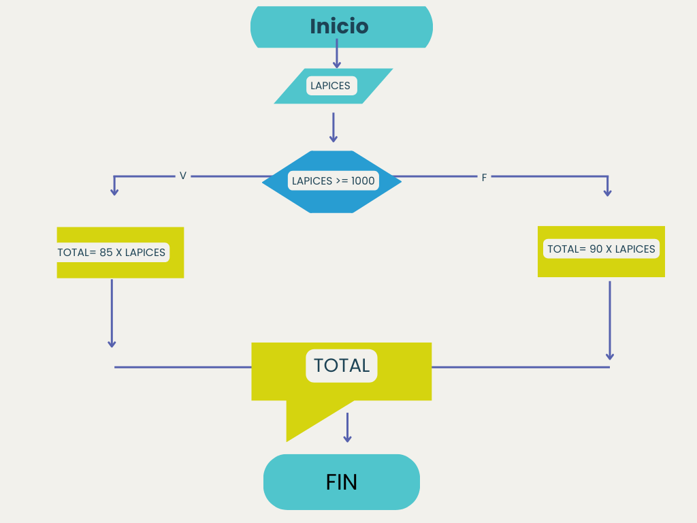

# BITACORA DE CLASE/ Actividad 3

##  ¿Que es un diagrama de flujo?

Los diagramas de flujo son herramientas visuales que emplean una variedad de símbolos estandarizados para representar las diferentes operaciones y pasos en un algoritmo o proceso. A continuación, se detallan los símbolos más comunes y su significado:

- Inicio/Fin (Óvalo): Este símbolo indica el punto de inicio o finalización del diagrama de flujo. Generalmente contiene las palabras "Inicio" o "Fin".

- Proceso (Rectángulo): Representa una operación o acción específica dentro del proceso, como una tarea o actividad que se debe realizar.

- Decisión (Diamante): Utilizado para plantear una pregunta o condición que determinará el flujo del proceso, bifurcándose en diferentes caminos según la respuesta (por ejemplo, "Sí" o "No").

- Entrada/Salida (Paralelogramo): Indica la entrada de datos al sistema o la salida de información del mismo, como la recepción de una entrada del usuario o la presentación de un resultado.

- Conector (Círculo): Se emplea para conectar diferentes partes del diagrama, especialmente cuando el flujo se extiende a otra página o sección, facilitando la continuidad y evitando líneas cruzadas.

- Almacenamiento de Datos (Cilindro): Simboliza la etapa en la que los datos se almacenan en una base de datos o archivo.

- Documento (Rectángulo con una onda en la parte inferior): Representa un documento o informe generado durante el proceso.

- Preparación (Hexágono): Indica una etapa de configuración o inicialización necesaria antes de continuar con el siguiente paso del proceso.

- Entrada Manual (Trapecio): Señala un punto donde se requiere que un usuario introduzca información manualmente.

- Visualización (Pantalla): Muestra información que se presenta al usuario, como en una pantalla o panel de control.

Es importante utilizar estos símbolos de manera coherente y estandarizada para garantizar que el diagrama de flujo sea claro y comprensible para todos los que lo consulten. 

## Ejercicio 1
Realice un algoritmo para determinar cuánto se debe pagar por equis cantidad de lápices considerando que si son 1000 o más el costo es de $85 cada uno; de lo contrario, el precio es de $90. Represéntelo con el pseudocódigo y el diagrama de flujo.

### Pseudocódigo 

     INICIO
     Leer cantidad de lapices 
         Si cantidad de lapices >= 1000
            Total = 85 * cantidad de lapices 
         sino 
          Total = 90 * cantidad de lapices 
     Escribir valor total a pagar ($)
     FIN 

### Diagrama de Flujo 
 

## Ejercicio 2

Un almacén de ropa tiene una promoción: por compras superiores a $250 000 se les aplicará un descuento de 15%, de caso contrario, sólo se aplicará un 8% de descuento. Realice un algoritmo para determinar el precio final que debe pagar una persona por comprar en dicho almacén y de cuánto es el descuento que obtendrá. Represéntelo mediante el pseudocódigo y el diagrama de flujo.

### Pseudocodigo 
    INICIO 
    Leer compra 
         Si compra > 250000 
            descuento = compra * 0.15
         Si no
            descuento = compra * 0.08
        FIN si 
        total = compra - descuento 
        Escribir total a pagar 
        escribir valor del descuento aplicado

### Diagrama de flujo 

## Ejercicio 3

El director de una escuela está organizando un viaje de estudios, y requiere determinar cuánto debe cobrar a cada alumno y cuánto debe pagar a la compañía de viajes por el servicio. La forma de cobrar es la siguiente: si son 100 alumnos o más, el costo por cada alumno es de $65.00; de 50 a 99 alumnos, el costo es de $70.00, de 30 a 49, de $95.00, y si son menos de 30, el costo de la renta del autobús es de $4000.00, sin importar el número de alumnos.

### Pseudocodigo 

    INICIO
    Escribir "Ingrese la cantidad de alumnos."
    -leer cantidad

     Si cantidad >= 100
        Precio = 65 
    Sino si cantidad > 50 
        precio = 70
    sino si cantidad >= 30
        precio= 95
    sino 
    precio = 4000/alumnos 

## Ejercicios propuestos 

1. Un profesor tiene un salario inicial de $1500, y recibe un incremento de 10% anual durante 6 años. ¿Qué salario ha recibido en cada uno de los 6 años?. Realice el algoritmo y represente la solucion mediante el diagrama de flujo, el pseudocodigo y el diagrama N/S, utilizando el ciclo apropiado. 

### Pseudocodigo 
    INICIO
    salario inicial = $1500
    incremeto = 0.10
    salario con incremento + salario inicial 
        Para año = 1 hasta 6 hacer 
    Escribir "año" año, ": $", salario 
        salario = salario * 0.10 // Incremento del 10%
    Fin 

4. Solicitar al usuario 2 números enteros, imprimir en pantalla los numeros pares comprendidos entre ellos:

**Pseudocodigo:**

    INICIO
    Ingresar “primer número entero”
	Leer num1
    Ingresar “segundo número entero”
	Leer num2
    Asegurar que num1 sea menor que num2 
    Si num1 > num2
	    Mayor = num1
	    Menor = num2
    Si no 
	    Mayor = num2
	    Menor = num1 Fin si 
	Mientras menor < mayor 
		Si residuo (menor, 2) =0 // si menor es par 
			Escribir menor 
	Fin si 
		Menor = menor +1
	Fin mientras 
     Fin 

5. Serie de fibonacci. algoritmo, ¿Cuántos números de la serie desea imprimir?

        INICIO 
        Leer n
            a = 0
            b = 1
        Escribir a, b 
            n= n - 2
        Mientras n > 0
            res = a + b
        Escribir 
            a = b
            b = resn = n - 1
        Fin mientras FN

## Consulta

### Parte 1: **Identificar Algoritmos**
Responde si los siguientes enunciados representan un algoritmo. Justifica la respuesta:

- Una página web.

     No es un algoritmo, ya que una página web es un conjunto de elementos estáticos o dinámicos, pero no sigue una secuencia de pasos con un inicio y un fin definido.

- Una receta para hacer un pastel, donde se indican ingredientes y pasos a seguir.

     Sí es un algoritmo, ya que describe una secuencia de pasos específicos a seguir para obtener un resultado final (el pastel).

- "Piensa en un número y multiplícalo por otro".

     No es un algoritmo completo, porque no indica un inicio claro, ni qué hacer con el resultado, ni se define un fin.

- Un manual de instrucciones para armar un mueble, con pasos detallados y un orden claro.

     Sí es un algoritmo, ya que proporciona una serie de pasos secuenciales para lograr un objetivo claro (armar el mueble).

- Una lista de compras organizada en orden alfabético.

     No es un algoritmo, ya que solo es una colección de elementos sin un conjunto de pasos para procesarlos o llegar a un resultado.

### Parte 2: Variables y Constantes

Indica si las siguientes afirmaciones describen una variable o una constante:

- El valor de la gravedad en la Tierra, 9.8 m/s².

    **R/=** Constante, porque su valor es fijo y no cambia.

- La edad de una persona calculada con base en el año actual y su año de nacimiento.

    **R/=**  Variable, ya que su valor cambia cada año.

- La cantidad de dinero en una cuenta bancaria.

    **R/=** Variable, ya que puede aumentar o disminuir con depósitos y retiros.

- La velocidad de la luz en el vacío, 299,792,458 m/s.

    **R/=** Constante, porque su valor es universalmente fijo.

- El radio de un círculo.

    **R/=** Variable, porque su valor depende del tamaño del círculo y puede cambiar.

### Parte 3: Características de los Algoritmos
Responde si los siguientes enunciados cumplen con las características de un algoritmo. Justifica la respuesta:

Para elegir la ruta más corta entre varias ciudades, el algoritmo examina rutas candidatas, deteniéndose cuando los cambios en la distancia parecen lo suficientemente pequeños.
 
- No cumple completamente, ya que un algoritmo debe ser preciso y finito. Si el criterio de finalización es ambiguo ("suficientemente pequeños"), entonces no es determinista.

Suma los números ingresados y muestra el resultado.

- Sí cumple, ya que tiene pasos bien definidos: recibir números, sumarlos y mostrar un resultado.

Un conjunto de pasos para calcular el área de un rectángulo dado su base y altura.

- Sí cumple, porque tiene una secuencia clara: obtener datos, calcular con la fórmula y devolver el resultado.

El algoritmo cuenta el número de votos obtenidos por cada uno de los candidatos de una elección para presidente. Empieza solicitando el nombre del candidato y finaliza cuando se ingresa el valor -1.

- Sí cumple, ya que tiene un inicio (solicitar datos), procesamiento (contar votos) y una condición de finalización clara (cuando se ingresa -1).

### Parte 4: Comprensión de Herramientas
Indica si las siguientes afirmaciones son ciertas o falsas respecto al pseudocódigo y diagramas de flujo:

El pseudocódigo utiliza símbolos estándar para representar las operaciones lógicas.

- Falso. El pseudocódigo usa una escritura estructurada basada en instrucciones de texto, pero no símbolos gráficos estandarizados como los diagramas de flujo.

Los diagramas de flujo son una representación gráfica de un algoritmo.

- Cierto. Los diagramas de flujo utilizan símbolos como óvalos, rectángulos y rombos para representar los pasos de un algoritmo de manera visual.

El pseudocódigo debe estar escrito en un lenguaje de programación específico.

- Falso. El pseudocódigo no sigue la sintaxis de un lenguaje de programación en particular; es una forma estructurada de representar un algoritmo usando un lenguaje natural o simplificado.

Un diagrama de flujo siempre debe tener un inicio y un fin claramente definidos.

- Cierto. Todo diagrama de flujo debe comenzar con un símbolo de inicio y terminar con un símbolo de fin para garantizar que el algoritmo sea finito y estructurado correctamente.

### Parte 5: Estructuras de Control
Las **estructuras de control** son mecanismos que permiten definir el flujo de ejecución de un programa o de una actividad en la vida cotiadiana. Se dividen en:

- Secuenciales: Instrucciones que se ejecutan en orden, una tras otra.

- Condicionales (if, else): Permiten tomar decisiones según una condición.

- Repetitivas o Bucles (while, for): Ejecutan un bloque de código varias veces mientras se cumpla una condición.

### Ejemplo 1
- Problema: Decidir la temaperatura del agua para bañarse segun el clima 
- **Agoritmo**
1. Revisar el clima 
2. *Si* hace frio, usar agua caliente 
3. *si no*, usar agua fria 
4. Bañarse con la temperatura del agua elegida

- Pseudocodigo: 
    
        Si (temperatura_ambiente < 20°C)
            usar agua caliente 
        Sino 
            Usar agua fria 
        Fin Si
### Ejemplo 2
- Problema: Comprar frutas con un presupuesto de $10000, priozando manzanas a $2000 cada una y plátanos a $1000 cada uno.
- **Algoritmo**
1. Iniciar con $10000.
2. Mientras haya dinero:
    - si quedan manzanas $2000 o mas, comprar una manzana 
    - si queda entre $1000 y $1900, comprar un plátano.
    - si queda menos de $1000, detener la compra.
3. Calcular cuántas frutas se compraron.
- **Pseudocodigo:**

        Dinero = $10000
        Manzanas = 0
        Plátanos = 0

        Mientras (Dinero >= $1000)
            Si (Dinero >= $2000)
                comprar manzana 
                manzanas = manzanas + 1
                Dinero = Dinero - $2000
            Sino
                comprar plátano
                plátano = plátano + 1
                Dinero = Dinero - $1000
            Fin si
        Fin Mientras 
        Mostrar "compraste", manzanas, "Manzanas y ", platanos , "Plátanos"

